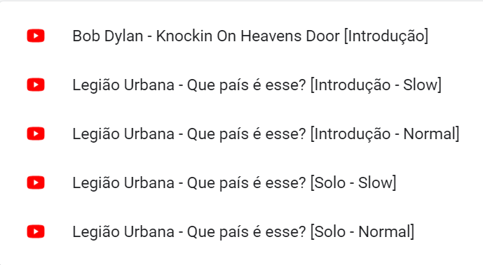

# Quer aprender a tocar guitarra, violão ou outro instrumento?
# Conheça algumas extensões do Chrome que podem te auxiliar

## Dividir para conquistar

Com a extensão [Looper for YouTube](https://chrome.google.com/webstore/detail/looper-for-youtube/iggpfpnahkgpnindfkdncknoldgnccdg/related?hl=pt-BR) é possível treinar determinados trechos de músicas:

Também é possível salvar os trechos nos seus favoritos:

## Treine com velocidade
A extensão [Video Speed Controller](https://chrome.google.com/webstore/detail/video-speed-controller/nffaoalbilbmmfgbnbgppjihopabppdk) permite diminuir a velocidade de vídeos:

## Marque suas páginas como visualizadas

Com a extensão [Mark As Read
](https://chrome.google.com/webstore/detail/mark-as-read/hiflhkmicfagennabmnfcnnlpkmidfjj) é possível marcar páginas como lidas facilitando a organização dos seus estudos:

